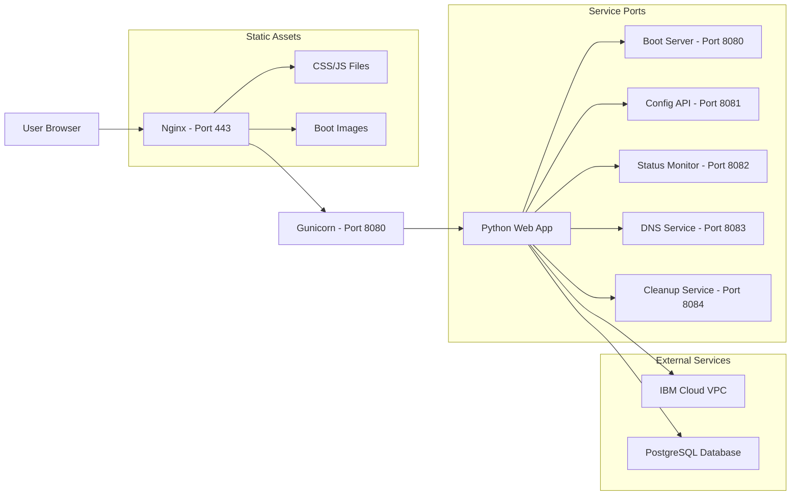
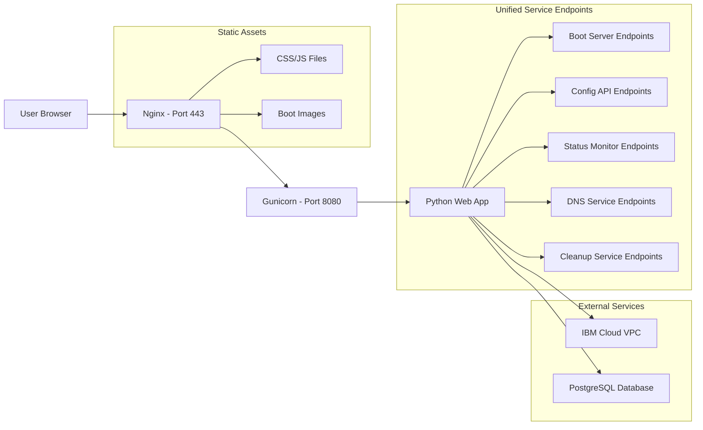

# Architecture Diagram

## Current Architecture Flow

## Proposed Architecture Flow

## Component Details

### User Browser
- Accesses web interface and API endpoints
- Communicates over HTTPS (port 443)

### Nginx (Port 443)
- SSL termination
- Static file serving (CSS, JS, boot images)
- Reverse proxy to Gunicorn
- Security headers
- Request routing based on path

### Gunicorn (Port 8080)
- WSGI server for Python application
- Multiple worker processes
- Request handling and load distribution

### Python Web App
- Flask-based application
- Multiple service modules:
  - Boot Service: Handles iPXE boot requests
  - Node Provisioner: Manages node provisioning
  - Status Monitor: Tracks deployment progress
  - DNS Service: Manages DNS records
  - Cleanup Service: Handles resource cleanup
- Database integration
- IBM Cloud API integration

### External Services
- IBM Cloud VPC: Infrastructure provisioning
- PostgreSQL Database: Persistent storage for node and deployment data

### Static Assets
- CSS/JS files for web interface
- Boot images for node provisioning