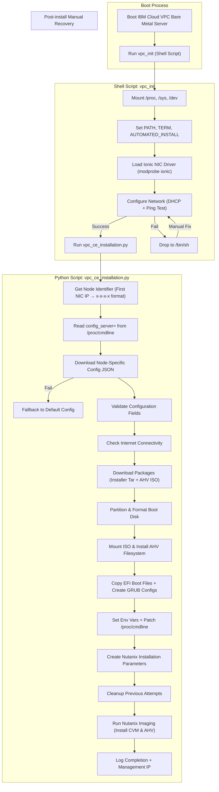
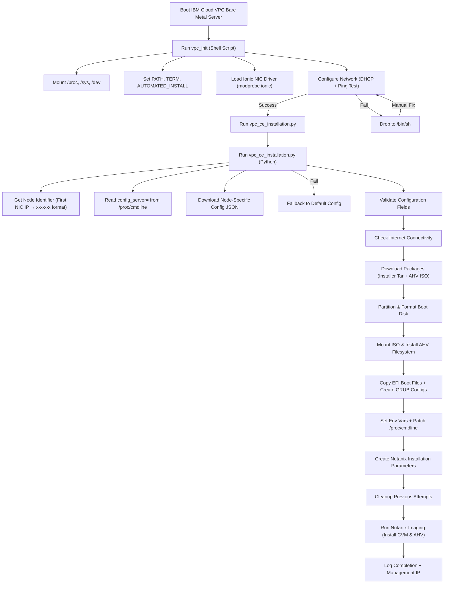

# Fully Automated Nutanix CE Deployment on IBM Cloud VPC

## Overview
Nutanix CE is designed for specific physical hardware with IPMI access, so installing it on IBM Cloud VPC bare metal servers requires installing Ionic drivers for the Pensando SmartNICs, bypassing hardware checks, mocking system parameters, and preventing the Nutanix installer from making assumptions about physical disk layouts that don't apply in VPC.

## Prerequisites
- IBM Cloud VPC Bare Metal server with Pensando SmartNICs
- PXEConfig server with HTTP server
- Nutanix CE ISO and installation files
- Host system with ionic driver available (typically IBM Cloud VPC instances)

### System Architecture After Installation

```bash
┌────────────────────────────────────────────────────────────────┐
│                    IBM Cloud VPC Bare Metal                    │
├────────────────────────────────────────────────────────────────┤
│  Network: Pensando SmartNICs + Ionic Driver                    │
│  ┌─────────────────────┐      ┌──────────────────────────────┐ │
│  │   AHV Hypervisor    │      │    Controller VM (CVM)       │ │
│  │   ───────────────   │      │    ─────────────────────     │ │
│  │   • KVM/QEMU        │      │    • Nutanix OS (AOS)        │ │
│  │   • nvme0n1 (447GB) │      │    • 32GB RAM, 16 vCPUs      │ │
│  │   • CentOS 8 based  │      │    • nvme1n1 (boot)          │ │
│  │                     │      │    • nvme1n1-4n1 (storage)   │ │
│  └─────────────────────┘      └──────────────────────────────┘ │
├────────────────────────────────────────────────────────────────┤
│  Storage: 4x NVMe drives (7TB each) = ~28TB total capacity     │
└────────────────────────────────────────────────────────────────┘
```

## Swimlane


Stage overview:
* IBM Cloud VPC Stage
    * Bare metal instance creation, PXE boot, initrd loading.
* Shell Prep Stage (vpc_init)
    * Minimal OS prep, driver load, network setup, script handoff.
* Python Install Stage (vpc_ce_installation.py)
    * Node identification, config fetch, package download, hypervisor + CVM imaging.
* Post-Install Stage
    * First boot of AHV.
    * CVM starts automatically.
    * Foundation API or Prism CLI used to create/join cluster.
    * Networking, storage pools, licensing applied.
    * Prism web console is online, Nutanix CE fully operational.


## Ionic driver support

As the bare metal server has Pensando SmartNICs, it requires ionic drivers which are not on the Nutanix CE ISO. However, they are available on the PXE\Config server, so as part of the initial setup of the PXE server:

- The Nutanix CE ISO is downloaded and mounted.
- The CVM installation package and AHV is extracted and copied to `/var/www/pxe/images` so they can be served via HTTP to the bare metal server.
- The initrd is extracted.
- The ionic drivers are added to initrd.
- The `dhcp_network.sh` is patched to load the ionic drivers.
- initrd is repacked and copied to `/var/www/pxe/images` so they can be served via HTTP to the bare metal server.


The following code snippet, part of `setup.sh` does the following:

* Creates a working directory
* Extracts the original initrd from the mounted Nutanix CE ISO
* Finds the ionic driver from the PXE\Config VSI
* Adds the ionic driver to initrd
* Updates modules.dep
* Creates an init script `vpc_init` which loads the ionic drivers and launches the installation script `vpc_ce_installation.py`
* Creates `vpc_ce_installation.py`
* Repacks initrd
* Creates symlink
* Verifies integrity
* Cleans up

```bash
build_initrd-vpc() {
    local work_dir="/tmp/nutanix-build-$(date +%s)"
    local output_dir="/var/www/pxe/images"
    
    log "Building initrd-vpc..."
    
    # Create working directory
    mkdir -p "$work_dir"
    cd "$work_dir"
    
    # Extract original initrd
    log "Extracting original initrd..."
    gunzip -c "$output_dir/initrd.img" | cpio -i -d -H newc --no-absolute-filenames
    
    # Find and add ionic driver
    log "Locating ionic driver..."
    local ionic_driver=""
    for path in \
        "/lib/modules/$(uname -r)/kernel/drivers/net/ethernet/pensando/ionic/ionic.ko" \
        "/lib/modules/$(uname -r)/extra/ionic.ko" \
        "/lib/modules/$(uname -r)/updates/ionic.ko"; do
        if [ -f "$path" ]; then
            ionic_driver="$path"
            break
        fi
    done
    
    if [ -z "$ionic_driver" ]; then
        log "ERROR: Ionic driver not found on host system"
        exit 1
    fi
    
    log "Found ionic driver: $ionic_driver"
    
    # Add ionic driver to initrd
    local kernel_ver=$(uname -r)
    mkdir -p "./lib/modules/$kernel_ver/kernel/drivers/net/ethernet/pensando/ionic"
    cp "$ionic_driver" "./lib/modules/$kernel_ver/kernel/drivers/net/ethernet/pensando/ionic/"
    
    # Update modules.dep
    echo "kernel/drivers/net/ethernet/pensando/ionic/ionic.ko:" >> "./lib/modules/$kernel_ver/modules.dep"
    
    # Copy the vpc_init script to the $work_dir
    log "Copying vpc_init script..."
    cp $PROJECT_DIR/vpc_init vpc_init
    chmod +x vpc_init

    # Copy the vpc_ce_installation.py script to the $work_dir
    log "Copying automated_installation script.py script..."
    cp $PROJECT_DIR/vpc_ce_installation.py phoenix/vpc_ce_installation.py
    chmod +x phoenix/vpc_ce_installation.py

    # Repack initrd
    local timestamp=$(date +%Y%m%d_%H%M%S)
    local output_file="$output_dir/initrd-ionic-$timestamp.img"
    
    log "Repacking initrd..."
    find . | cpio -o -H newc | gzip > "$output_file"
    
    # Create symlink
    cd "$output_dir"
    ln -sf "initrd-ionic-$timestamp.img" "initrd-ionic.img"
    
    # Verify integrity
    if gzip -t "$output_file"; then
        log "Ionic-enabled initrd created successfully: $(basename "$output_file")"
    else
        log "ERROR: Failed to create valid initrd"
        exit 1
    fi
    
    # Cleanup
    rm -rf "$work_dir"
}
```
## vpc-init

This is an init-like script for the bare metal server boot environment, specifically tailored for IBM Cloud VPC bare metal to run Nutanix CE. It ensures that the Ionic NIC driver is active before trying network installs. The network configuration is minimal and automated, it only sets up the first detected NIC and uses DHCP. It then directly launches the automated installer. The following code snippet, part of `setup.sh` does the following:

* Prints a startup message: `"=== Nutanix CE Direct Boot with Ionic ==="`.
* Mounts essential virtual filesystems needed for Linux userland to function properly:
    * Mounts `proc` to `/proc` (process information).
    * Mounts `sysfs` to `/sys` (kernel objects, device info).
    * Mounts `devtmpfs` to `/dev` (device nodes).
    * Ignores errors (`2>/dev/null || true`), so the script won’t fail if already mounted.
* Sets environment variables:
    * Adds `/usr/sbin:/usr/bin:/sbin:/bin:/root/phoenix` to the `PATH`.
    * Sets `TERM=linux` for terminal behavior.
    * Sets `AUTOMATED_INSTALL=true` to flag automation.
* Loads Ionic NIC Driver:
    * Prints `"Loading ionic driver for IBM Cloud VPC..."`.
    * Tries to load the `ionic` kernel module (`modprobe ionic`).
    * If successful:
      * Waits 3 seconds for initialization.
      * Lists detected network interfaces in `/sys/class/net` (excluding `lo` loopback).
    * If unsuccessful:
      * Prints `"Ionic driver not available"`.
* Calls the `configure_network_direct` function which:
    * Waits for interfaces:
      * Loops up to 30 times, checking for any NIC besides `lo`.
      * Waits 2 seconds between checks.
    * Configures the first interface found:
      * Brings interface `up` (`ip link set $iface up`).
      * Sleeps 2 seconds.
      * Runs DHCP request with timeout (`dhclient -v $iface`).
      * If DHCP succeeds:
        * Pings `8.8.8.8` (Google DNS) to verify connectivity.
        * If ping succeeds:
          * Exports `CONFIGURED_INTERFACE` with the interface name.
        * If ping fails: logs that DHCP worked but no internet is reachable.
      * If DHCP fails: logs failure.
    * If no configuration works: logs `"Network configuration failed"`.
* Launches the automated installation script:
    * Checks for `/root/phoenix/vpc_ce_installation.py`.
    * If present: changes to `/root/phoenix` and runs it with Python 3.
    * If not present: drops to an interactive shell (`/bin/sh`).

## vpc_ce_installation.py

`vpc_ce_installation.py` script is a fully automated Nutanix CE installer tailored for IBM Cloud VPC bare metal nodes using the Ionic NIC driver, with logic to:

* Identify the node.
* Download its specific configuration from the PXE\Config server.
* Download and install the Nutanix AHV hypervisor.
* Download, install and set up the Controller VM (CVM) environment.
* Run the Nutanix installation process non-interactively.

This script is effectively the Python-side installer that’s run after the shell-side environment prep, `vpc_init`. The shell script boots the environment, loads the NIC driver and configures networking, and then calls this script. This Python script handles all the heavy lifting of downloading, partitioning, installing AHV, and bringing up the Nutanix CVM. The following code snippet, part of `setup.sh` does the following:

* Prints a timestamped banner `"=== Nutanix CE Node-Agnostic Installation ==="`
* Declares platform: `"IBM Cloud VPC with Ionic Driver"`
* Provides `log()` helper for timestamped console messages.
* Phase 1 — Node Identification & Config Retrieval:
    * Identify Node by IP:
       * Lists network interfaces in `/sys/class/net/`, ignores `lo`.
       * Picks the first non-loopback NIC.
       * Runs `ip addr show` to get its IP.
       * Returns IP in `x-x-x-x` format (used as a node ID for config lookup).
       * Falls back to `"default"` if detection fails.
    * Read Config Server from Kernel Cmdline:
       * Opens `/proc/cmdline` and looks for `config_server=` parameter.
       * Returns the config server URL if found.
    * Download Node-Specific Config:
       * Forms URL: `{config_server}/boot/server/{node_id}.json`.
       * Uses `curl` to fetch JSON config (10s connect timeout, 30s total).
       * Parses JSON and returns it if valid.
       * Falls back to a **default hardcoded config** if download fails.
* Phase 2 — Validate Configuration:
    * Checks for required sections: `node`, `hardware`, `resources`, `network`.
    * Checks required fields in those sections (block\_id, boot\_disk, cvm\_data\_disks, memory, network params, etc.).
    * Logs validation result.
* Phase 3 — Package Downloads:
    * Ensures internet connectivity by opening TCP to `8.8.8.8:53`.
    * Downloads:
      * `nutanix_installer_package.tar.gz`
      * AHV ISO (`AHV-DVD-x86_64-el8...iso.iso`)
    * Saves to `/tmp`.
    * Verifies file size > 1KB.
    * Fails if any download is unsuccessful.
* Phase 4 — Hypervisor Installation:
    * Partition Boot Disk using `fdisk` to create:
         * 1MB EFI partition (type EF).
         * 20GB hypervisor partition (ext4).
         * A third partition (purpose unclear here).
    * Format Partitions:
        * `mkfs.vfat` for EFI.
        * `mkfs.ext4` for hypervisor.
    * Mount and install:
       * Mounts `/mnt/stage` for AHV hypervisor target.
       * Mounts AHV ISO and install image.
       * Copies AHV filesystem into target.
       * Mounts EFI partition and copies bootloader files.
    * Configure Bootloaders:
       * Creates GRUB2 config pointing to `/dev/{boot_disk}p2` as root. 
       * Creates legacy GRUB config pointing to `/dev/{boot_disk}p2` as root. 
    * Unmounts everything and marks the install complete.
* Phase 5 — Environment Setup:
    * Sets env vars for community edition & automation.
    * Adds `/root/phoenix` and local site-packages to Python path.
    * Monkey-patches `open('/proc/cmdline')` so Nutanix tools see config values instead of actual boot cmdline.
* Phase 6 — Create Nutanix Install Parameters:
    * Imports `param_list` and fills parameters for:
      * Node identifiers (block\_id, serial, cluster\_id)
      * Hardware details (disk layout, model, sizes)
      * CVM resources (RAM, vCPUs)
      * Hypervisor type/version
      * CE-specific settings (EULA accepted, no 1-node cluster)
    * Returns a parameter object for installation.
* Phase 7 — Cleanup Previous Attempts:
    * Deletes stale install directories and marker files under `/tmp`.
* Phase 8 — Run Nutanix Installation*:
    * Imports Nutanix install modules (`imagingUtil`, `sysUtil`, `shell`).
    * Patches shell command execution to:
      * Block destructive commands like `wipefs` on the boot disk.
    * Bypasses hardware detection (forces layout acceptance).
    * Prints install summary:
      * Node serial
      * Hypervisor disk
      * CVM specs
      * Data drive count
      * Management IP
    * Calls `imagingUtil.image_node(params)` to run the actual imaging/install.
* Phase 9 — Completion:
    * Logs success message with management IP.
    * Returns exit code 0 on success, 1 on failure.

Flowchart:



How to read this:
* Blue Box (Shell) = vpc_init bootstrapping
* Green Box (Python) = vpc_ce_installation.py install logic
* Diamond/Branch = success/failure paths
* The process is linear if networking works, otherwise it stops at a shell for manual fix.
* The Python script phases are strictly ordered, and each step must succeed for the next to run.

## Configuration file

An example configuration file sent to the bare metal server when requested is shown below. It is compiled by `boot_service.py` from a template wehen the PXE\Config server recives a request like `http://nutanix-pxe-config.nutanix-ce-poc.cloud:8080/boot/config/10.240.0.10`

* Disk information is retrieved from `server_profiles`.
* Network information:
    * cvm_ip - from the database for the reserved IP.
    * cvm_netmask - from the vpc SDK for the management subnet.
    * cvm_gateway - from the vpc SDK for the management subnet.
    * dns_servers - from the vpc SDK for the VPC.

```json
{
    "hardware": {
        "model": "CommunityEdition",
        "boot_disk": "nvme0n1",
        "boot_disk_model": "Micron_7450_MTFD",
        "boot_disk_size_gb": 447,
        "cvm_data_disks": ["nvme1n1", "nvme2n1", "nvme3n1", "nvme4n1"],
        "cvm_boot_disks": ["nvme1n1"],
        "hypervisor_boot_disk": "nvme0n1"
    },
    "resources": {
        "cvm_memory_gb": 32,
        "cvm_vcpus": 16
    },
    "network": {
        "cvm_ip": "10.240.0.51",
        "cvm_netmask": "255.255.255.0", 
        "cvm_gateway": "10.240.0.1",
        "dns_servers": ["161.26.0.7", "161.26.0.8"]
        }
}
```
## iPXE Script

The iPXE script is generated by `boot_service.py` when it receives a request such as `http://nutanix-pxe-config.nutanix-ce-poc.cloud:8080/boot/config?mgmt_ip=10.240.0.10`. `boot_service.py` contains a template, as shown below, `{Config.PXE_SERVER_DNS}` gets replaced by the `boot_service.py` script with the FDQN of the PXE\Config server. `${{base-url}}` is double escaped wiyh `{}` to stop python expanding `${base-url}` as this gets expanded later by iPXE on the bare metal server.

```bash
...
#!ipxe
echo ===============================================
echo Nutanix CE Direct Installation
echo IBM Cloud VPC + Ionic Driver
echo ===============================================

:retry_dhcp
dhcp || goto retry_dhcp
sleep 2

# Set PXE server URL
set base-url http://{Config.PXE_SERVER_DNS}:8080

# Direct kernel boot with optimized parameters
kernel ${{base-url}}/boot/images/kernel init=/vpc_init config_server=${{base-url}} console=tty1 console=ttyS1,115200n8 intel_iommu=on iommu=pt kvm-intel.nested=1 kvm.ignore_msrs=1 kvm-intel.ept=1 vga=791 net.ifnames=0 IMG=squashfs PXEBOOT=true LIVEFS_URL=${{base-url}}/squashfs.img AUTOMATED_INSTALL=true

# Use VPC initrd
initrd ${{base-url}}/boot/images/initrd-vpc.img

boot || goto error

:error
echo Boot failed
shell
...
```
### Accessing the System

```bash
# Check system status via console
ssh nutanix@10.240.0.10  # AHV hypervisor access

# Access Prism web interface
https://10.240.0.10:9440/

# Default credentials
# Username: admin
# Password: (set during cluster initialization)
```

### Cluster Initialization

1. Open browser to `https://10.240.0.10:9440/`
2. Complete initial cluster setup wizard:
   - Set admin password
   - Configure DNS servers (8.8.8.8, 8.8.4.4)
   - Set NTP servers (pool.ntp.org)
   - Accept EULA
   - Configure data services IP
3. Wait for cluster services to initialize (10-15 minutes)
4. Begin deploying virtual machines

## Troubleshooting

### Ionic Driver Not Loading
```bash
# Debug ionic driver
lsmod | grep ionic
dmesg | grep ionic
lspci | grep -i pensando

# Solution: Verify driver in initrd
find /tmp/nutanix-production -name "ionic*"
modinfo /tmp/nutanix-production/lib/modules/5.10.2/kernel/drivers/net/ethernet/pensando/ionic/ionic.ko
```

### Network Interfaces Not Appearing
```bash
# Check network interfaces
ip addr show
ls /sys/class/net/

# Solution: Verify ionic loading in init scripts
grep -r "ionic" /tmp/nutanix-production/
```

### Installation Hangs at Package Download
```bash
# Check network connectivity
ping 8.8.8.8
curl -I http://pxe-server.com/boot/images/squashfs.img

# Solution: Verify PXE server accessibility
```

### Hypervisor Installation Fails
```bash
# Check partition layout
lsblk /dev/nvme0n1
fdisk -l /dev/nvme0n1

# Solution: Recreate partitions
fdisk /dev/nvme0n1  # Create EFI + hypervisor + data partitions
```
