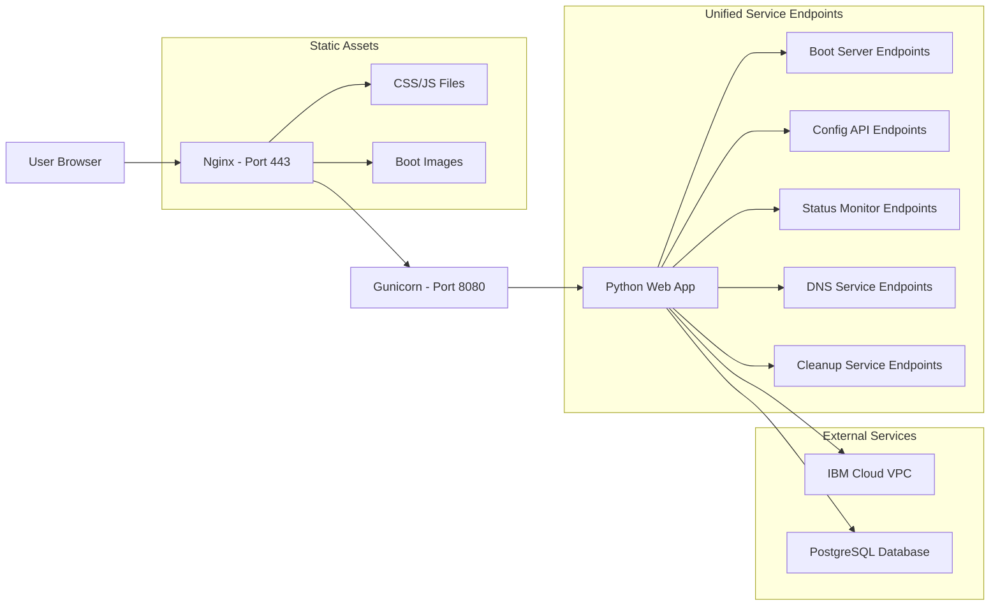

# Nginx Reverse Proxy Implementation Summary

## Project Overview
This document summarizes the comprehensive plan for implementing an Nginx reverse proxy architecture for the Nutanix VPC Orchestrator, replacing the current multi-port setup with a consolidated, path-based routing system that follows industry best practices for security, performance, and maintainability.

## Current Architecture Analysis
The existing Nutanix VPC Orchestrator uses a complex multi-port architecture with services distributed across ports 8080-8084:
- **Port 8080**: Boot server endpoints
- **Port 8081**: Configuration API endpoints
- **Port 8082**: Status monitoring endpoints
- **Port 8083**: DNS registration endpoints
- **Port 8084**: Cleanup management endpoints

This approach results in:
- Complex Nginx configuration with multiple server blocks
- Inefficient resource utilization
- Higher maintenance overhead
- Increased security surface area

## Proposed Architecture
The new architecture consolidates all services under a single HTTPS endpoint (port 443) with path-based routing:

## Key Improvements

### 1. Port Consolidation
- **Before**: 5 separate ports (8080-8084)
- **After**: Single HTTPS endpoint (443) with path-based routing
- **Benefits**: Simplified configuration, reduced resource usage, easier maintenance

### 2. Path-Based Routing Structure
- `/boot/` - Boot server endpoints
- `/api/config/` - Configuration API endpoints
- `/api/status/` - Status monitoring endpoints
- `/api/dns/` - DNS registration endpoints
- `/api/cleanup/` - Cleanup management endpoints
- `/` - Web interface

### 3. Security Enhancements
- Centralized SSL termination with strong cipher suites
- Comprehensive security headers
- Rate limiting for API endpoints
- IP-based access control for sensitive endpoints
- Improved authentication and authorization

### 4. Performance Optimizations
- Efficient static file serving with caching
- Proxy caching for API responses
- Connection pooling and keep-alive optimization
- Gzip compression for text-based assets
- Worker process optimization

## Implementation Components

### 1. Nginx Configuration
- Modular configuration structure
- Path-based routing with consolidated server block
- SSL termination with security headers
- Static file serving optimization
- WebSocket support for real-time features
- Rate limiting and access control

### 2. Gunicorn Configuration
- Optimized worker processes based on CPU count
- Memory management and restart policies
- Timeout configurations for better reliability
- Enhanced logging and monitoring
- Performance tuning for request handling

### 3. Application Code Changes
- Restructured route definitions for path-based routing
- Updated configuration to support new URL structure
- Modified web interface to use new endpoints
- Backward compatibility during transition period
- Enhanced error handling and logging

## Deployment Strategy

### Phased Approach
1. **Phase 1**: Staging environment deployment and testing
2. **Phase 2**: Production deployment during scheduled maintenance window
3. **Phase 3**: Post-deployment monitoring and validation

### Rollback Procedures
- Comprehensive backup strategy for all components
- Defined rollback criteria and procedures
- Regular rollback testing and validation
- Clear communication plan for stakeholders

## Testing Strategy
- Unit testing for all components
- Integration testing for service interactions
- System testing for end-to-end functionality
- Performance testing under various load conditions
- Security testing for vulnerability assessment
- User acceptance testing for functionality validation

## Expected Benefits
1. **Operational Efficiency**: Simplified configuration management and reduced maintenance overhead
2. **Security**: Centralized security controls and improved protection mechanisms
3. **Performance**: Better resource utilization and optimized response times
4. **Scalability**: Easier service expansion and improved load handling
5. **Reliability**: Enhanced error handling and more robust failure recovery

## Timeline
- **Preparation**: 1 week
- **Implementation**: 2 weeks
- **Testing**: 2 weeks
- **Deployment**: 1 week
- **Total Project Duration**: 6 weeks

## Success Criteria
- All services accessible through consolidated HTTPS endpoint
- Improved response times and resource utilization
- No service interruptions during transition
- Successful rollback capability demonstrated
- Positive user acceptance testing results
- Compliance with security and performance standards

This implementation will modernize the Nutanix VPC Orchestrator architecture while maintaining full functionality and improving operational characteristics across security, performance, and maintainability dimensions.